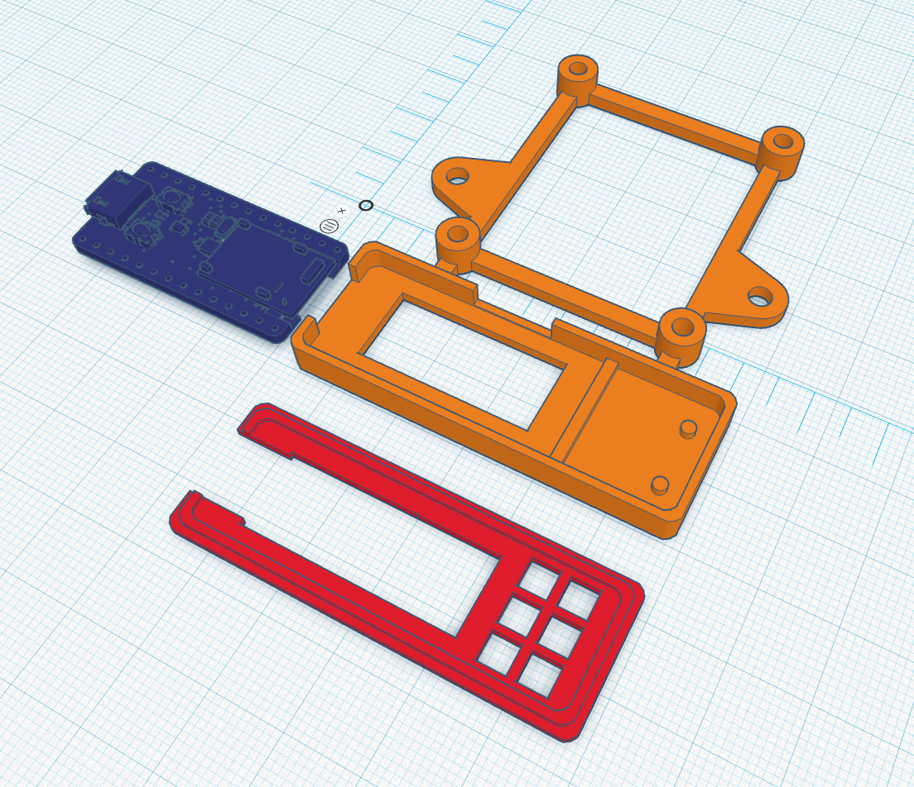

## Adafruit Aduio Visualizer
### Modified for Itsy bitsy

- Caution: Its a tight fit and I wouldn't recommend. Made this because adafruit was out of stock with long lead time. If you do use it, make the compartment taller to account for solder joints.
- Used pins A1 and A3 for PDM clock and data lines.

## Sources

- [Adafruit project](https://learn.adafruit.com/mini-led-matrix-audio-visualizer/overview)
- [Adafruit itsybitsy nRF52840 STL](https://github.com/adafruit/Adafruit_CAD_Parts/tree/main/4481%20ItsyBitsy%20nRF52840)
- [AdaFruit PDM Mic STL](https://github.com/adafruit/Adafruit_CAD_Parts/tree/main/4346%20PDM%20Mic%20Breakout)
- [Case example](https://www.thingiverse.com/thing:3460550)